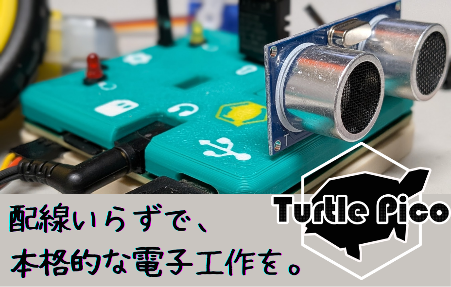
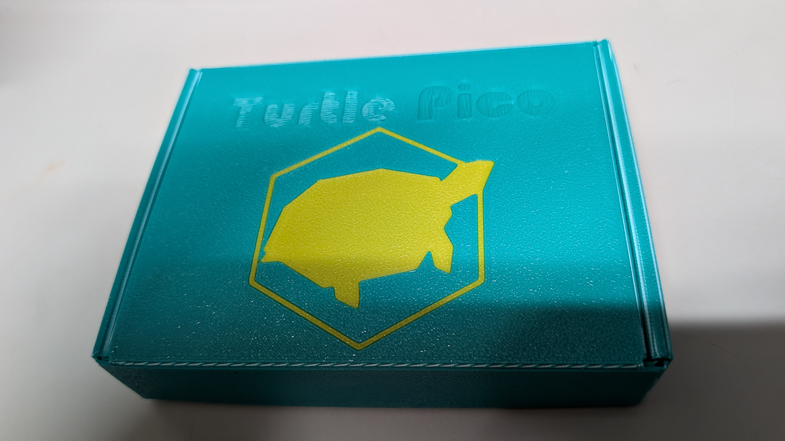
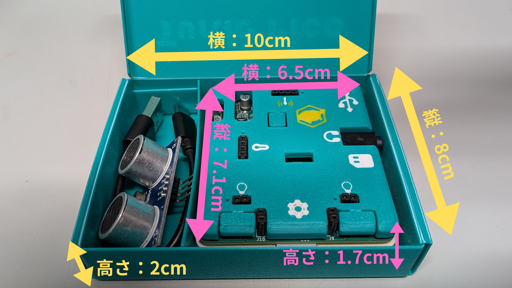
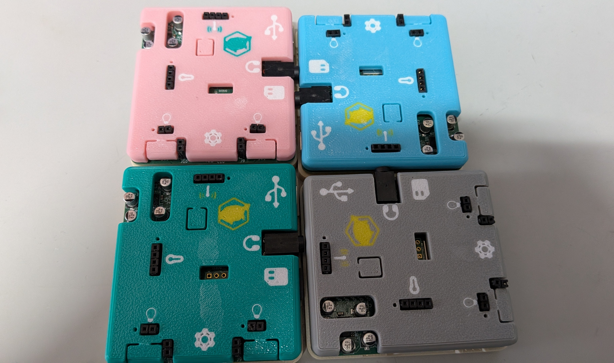
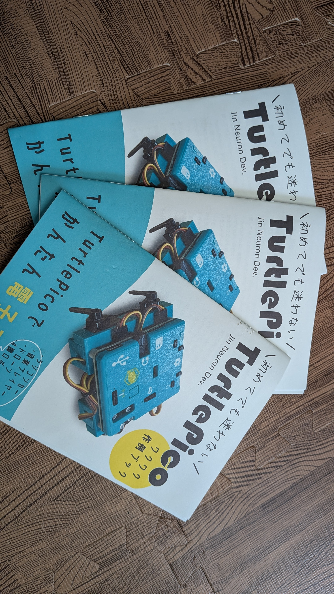
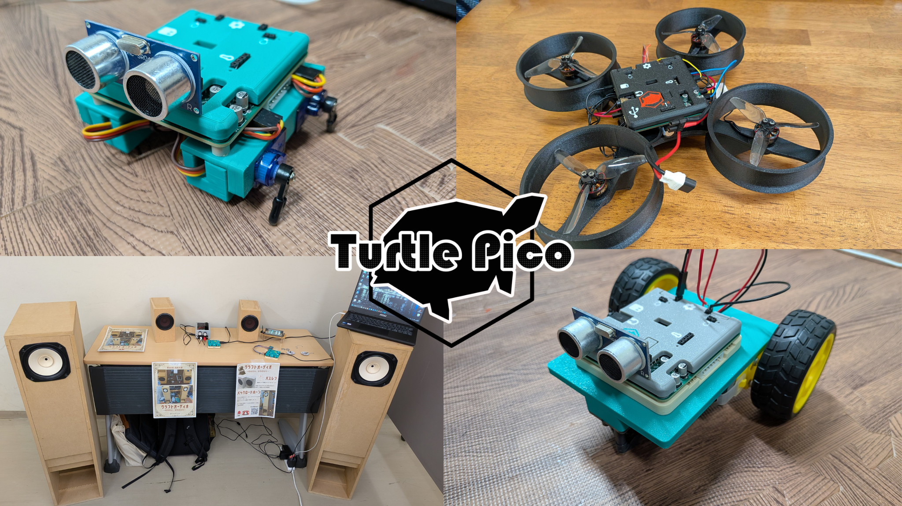

  <b>English</b> | <a href="README.md">日本語</a>

# Turtle Pico - Easy, Full-Fledged Electronics Without the Messy Wiring -

Hello! How do you usually solve troublesome issues in electronics projects?

Complicated wiring, difficult programming, complex environment setup, and the hassle of constantly checking pin configurations... When you enjoy electronic crafting, you inevitably run into several walls.

To overcome these challenges, we developed the Turtle Pico microcontroller board. With no breadboard required, you can complete circuits simply by connecting parts directly to the connectors. Since it is powered by the Raspberry Pi Pico W inside, you can use MicroPython for programming without ever having to worry about resource constraints.

When you plug an ultrasonic sensor into the connector, its appearance looks just like a turtle—which inspired the name "Turtle Pico"!

For detailed board specifications, please check the [Turtle Pico Specification](https://jinproduction.work/wp-content/uploads/2024/07/specific_en.pdf).

## Turtle Pico Product Package

Turtle Pico comes neatly packed in the package shown above.

Opening the box reveals this layout, with the dimensions of the main unit and outer box indicated in the image. The yellow text shows the outer box dimensions, and the pink text shows the main unit dimensions.

Inside the package is the Turtle Pico unit itself, housed in an original 3D-printed protective cover. Connector ports such as USB and MicroSD card slots are indicated with logos.

Please refer to the [Turtle Pico Specification](https://jinproduction.work/wp-content/uploads/2024/07/specific_en.pdf) for the meaning of each indicator.

The Turtle Pico comes in four color variations for its main body cover: Pink, Green, Gray, and Sky Blue.

## Turtle Pico Exciting Project Book

The commercial product version comes bundled with the project book above. It explains how to build various TurtlePico projects, whose source codes are available in [example](./example/).

Let's introduce some of the Turtle Pico friends featured in the project book:

At the top left is the "Turtle Pico Robot," a four-legged robot that waddles along using servo motor rotation. To its right is the "Turtle Pico Drone," and below that is the "Turtle Pico Car."

These designs can be easily expanded into various applications by changing what's mounted on top or adding different control logic. Be sure to use the project book as a reference to craft your very own custom application!

At the bottom left is an example of turning the Turtle Pico into a sound card to play music through speakers. The PCM5102A audio DAC equipped on the Turtle Pico supports up to 32-bit / 192kHz, making it a powerful audio DAC capable of handling high-resolution audio sources.

Therefore, by using the official sound card firmware, the TurtlePico can also transform into a board that lets you enjoy craft audio by connecting amplifiers and speakers around it.

The project book covers everything from how to build these projects to design and debugging methods, explaining manufacturing techniques made easy with modern "Vibe Coding". Since it comes bundled with your Turtle Pico purchase, be sure to grab one!

## License

This repository includes multiple components with different licenses.

Please reffer to [LICENSE File](License.txt).
